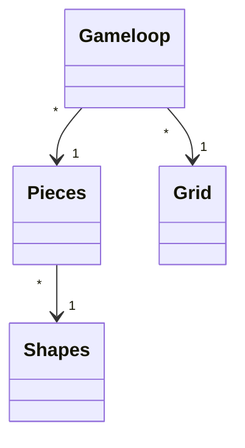
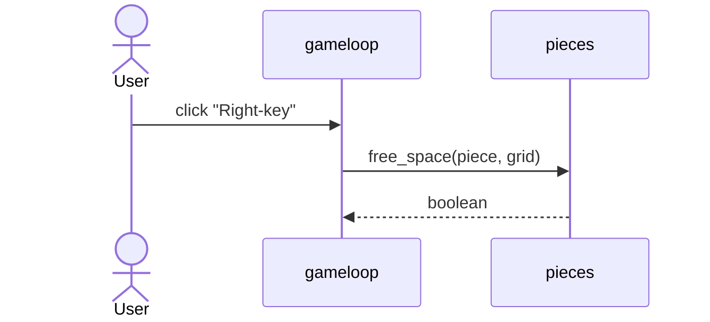

```mermaid
 classDiagram
      Pieces "*" --> "1" Shapes
      Gameloop "*" --> "1" Grid
      Gameloop "*" --> "1" Pieces
      
      class Shapes{
      }
      
      class Pieces{
      }
      
      class Gameloop{
      }
      
      class Grid{
      }
```

```mermaid
sequenceDiagram
  actor User
  participant gameloop
  participant pieces
  User->>gameloop: click "Right-key"
  gameloop->>pieces: free_space(piece, grid)
  pieces-->>gameloop: boolean
```
