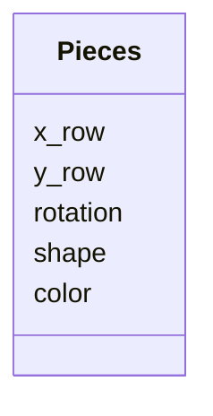
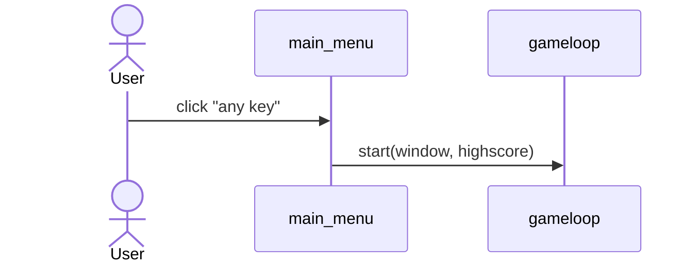
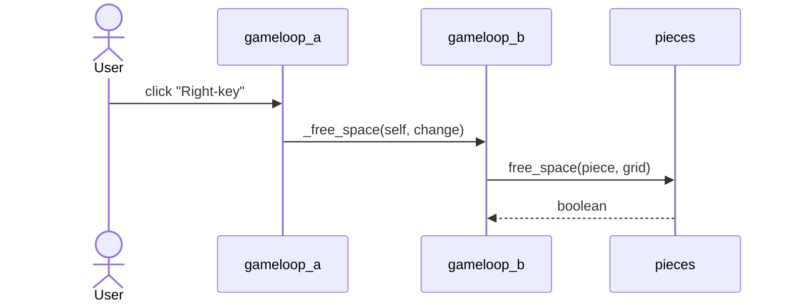

# Arkkitehtuurikuvaus
## Rakenne
Ohjelman koodin pakkausrakenne:

Luo kuva :
ui -> services -> repositories -> objects
                  objects
Pakkaus ui sisältää käyttöliittymän koodia, services sisältää sovelluslogiikkaa, repositories tiedon tallennusta vastaavaa koodia. Objects sisältää pelin eri palaset.

## Käyttöliittymä
Pelissä on kolme eri ruutua:
* Aloitus näkymä
* Peli
* Häviönäyttö

## Sovelluslogiikka
Sovelluksen tietomallin muodostaa luokka Pieces. Pieces kuvaa jokaista palaa

Peli kulkee GameLoop luokan kautta josta kutsutaan eri funktioita.

## Tietojen pysyväistallennus
Pakkauksen _repositories_ `ScoreRepository` toteuttaa tiedon tallettamisen. Tieto tallennetaan CSV-tiedostoon. 
Sovelluksen juuressa on on tiedosto [konfiguraatiotiedosto .env](https://github.com/HYTApio/ot-harjoitustyo/blob/master/.env) joka määrittelee tallennetun tiedoston nimen
CSV-tiedostoon tallennetaan vain ainoastaan pelaajan suurin pistemäärä.

### Pelin painallukset
Kun peliä pelataan käyttäjä voi painaa eri näppäimiä ja vaikuttaa peliin. 

Main menussa kun käyttäjä painaa mitä tahansa näppäintä, niin peli alkaa.

Pelin sisällä kun käyttäjä painaa jotakin näppäintä niin pelissä jotkut arvot yrittää muuttua. Tämä menee gameloopin sisällä, josta tarkistetaan ensin voiko arvo muuttua ja tämän jälkeen arvoa muutetaan. Kaikki käyttäjän tekemä pelin sisällä noudottaa tätä kaavaa. 
