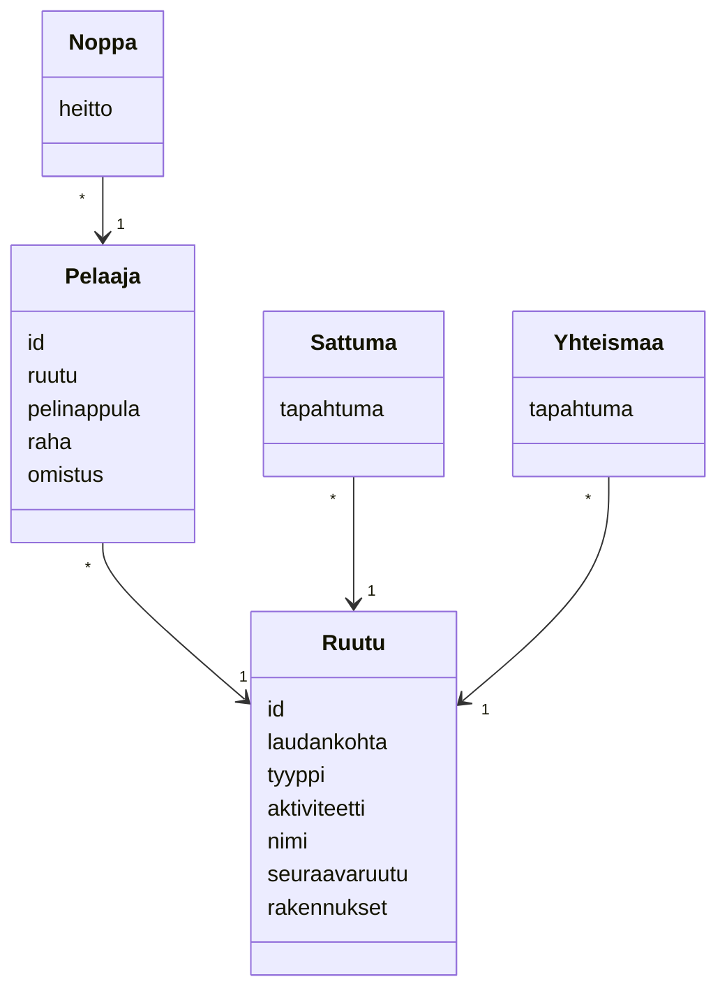

```mermaid
 classDiagram
      Noppa "*" --> "1" Pelaaja
      Pelaaja "*" --> "1" Ruutu
      Sattuma "*" --> "1" Ruutu
      Yhteismaa "*" --> "1" Ruutu
      
      class Pelaaja{
          id
          ruutu
          pelinappula
          raha
          omistus
      }
      
      class Noppa{
          heitto
      }
      
      class Ruutu{
          id
          laudankohta
          tyyppi
          aktiviteetti
          nimi
          seuraavaruutu
          rakennukset
      }
      
      class Sattuma{
          tapahtuma
      }
      
      class Yhteismaa{
          tapahtuma
      }
```
